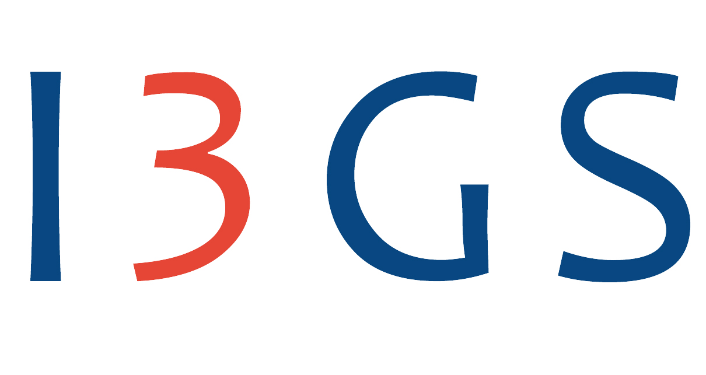

#### Table of Contents

1. [Experience](#experience)
2. [Education](#education)
3. [Certifications](#certifications)
4. [Publications](#publications)
5. [Skills](#skills)

 

---

# Experience

 

**Data Engineer**
 
> Period: June 2022 – Today    
🌎Brasília,Brazil

- Management of the volume, variety, speed and veracity of processes involving data; 
- Review and propose improvements to data models; 
- Build Data Marts – Multidimensional Modeling; 
- Define and implement ETLs (Airflow - SQLAgent Jobs - DBT); 
- Create integration flows with APIs (CRM/ Vai de Visa Integration); 
- Develop, sustain and improve dashboards/reports/internal processes (MIcrosoft SQL Server, Power BI);
- Develop OpenFinance (Phase 1,2 and 4);
- Participate on the migration of credit card processor, modeling and architecting new database systems.

---

 

 

**Data Engineer**

> Period: April 2021 – August 2022    
🌎Brasília,Brazil

- Management tools for obtaining, transforming, loading, serving and visualizing data 
- Create pipelines and ETLs (Airflow - DBT); 
- Collect and process data from different sources (APIs, Databases (PostgreSQL), Websites); 
- Present analysis and results through data visualization. (Power BI and MetaBase)

---

 
 

**Data Analyst - Developer Grant**

> Period: June 2020 – April 2021    
🌎Brasília,Brazil

- Construction of Machine Learning algorithm models (Python); 
- Process Automation (Python); 
- Database systems management (PostgreSQL) 
- Generate information about your potential developments, in particular, with the development of socio-environmental indicators.

---

 
 

**Researcher/ Data Scientist**

> Period: August 2019 – December 2022  
🌎Brasília,Brazil

- Apply Machine Learning models to real problems (Python); 
- Articles publication (Academic and online): Propensity Score Matching 
- Creation of Dashboards (BI): COVID-19: Previsões e Microsoft Power Bi; 
- WebScrapping (Python); 
- Leader of an ML project applied to sports. Machine Learning Algorithms for Football Predictions

---
 
 

**Market Intelligence Analyst**

> Period: May 2019 – August 2019  
🌎Brasília,Brazil

- Support the commercial area, managing new products campaigns data; 
- Provide reports, follow ups and new insights of Coca Cola Products and Campaigns; 
- Create incentives for the commercial area; 
- Monitor the salespeople performance;

---

   

**Intern**

> Period: December 2015 – January 2019  
🌎Brasília,Brazil

- Support the commercial area, creating presentations and treating data (Access,Excel); 
- Create Dashboards (Power BI, Excel);
- Create KPIs;

---

# Education

**MBA Course. Data Engineering**
    FIAP
    > Period: Ago 2024 – Ago 2025

**Postgraduate Course. Financial Management**
    Fundação Getúlio Vargas (FGV)
    > Period: Jan 2020 – Dec 2020

**Nanodegree Course. Data Scientist**
    Udacity
    > Period: May 2020 – Set 2020

**BA. Business Administration**
    University of Brasília (UnB)
    > Period: Jan 2014 – Dec 2018

**Student Exchange Program.Communication, Design Innovation**
    California State University (CSUN)
    > Period: Ago 2017 – Ago 2017

---

# Certifications

    <a href="https://learn.microsoft.com/api/credentials/share/en-us/MatheusKempaSeverino-9916/565E3F344FA4BC50?sharingId=C399ED3C5106353A" target="_blank" style="text-decoration: none; color: inherit; display: block; height: 100%;">
        
        

            <h4 style="margin: 0;font-family: Arial; font-size: 15px; font-weight: normal; color: #333;">Power BI Data Analyst Associate</h4>
            
Issuer: Microsoft

        

        

            PROVIDED BY Microsoft
        

    </a>

 

---

# Publications
[Machine learning algorithms for fraud prediction in property insurance: Empirical evidence using real-world microdata]: https://www.sciencedirect.com/science/article/pii/S2666827021000372

**[Machine learning algorithms for fraud prediction in property insurance: Empirical evidence using real-world microdata]**

> Period: January 2018 – January 2019
🌎Brasília,Brazil

This paper evaluated fraud prediction in property insurance claims using various machine learning models based on real-world data from a major Brazilian insurance company. The models were tested recursively and average predictive results were compared controlling for false positives and false negatives. The results showed that ensemble-based methods (random forest and gradient boosting) and deep neural networks yielded the best results, exhibiting superior average performance in comparison to the other classifiers, including the commonly used logistic regression. In addition, we compiled a general profile of confirmed fraudsters from the dataset and estimated the impact of each feature in the global classification performance and for prominent cases of false positive and false negative predictions using eXplainable Artificial Intelligence methods. The findings of this study can aid risk analysts and professionals in assessing the strengths and weaknesses of each model and to build empirically effective decision rules to evaluate future insurance policies.
    
---
# Skills

**Programming Languages:** Python, SQL, R

**Tools and Frameworks:**  Airflow, DBT, Power BI, Spark, Git, GraphQL, Flask, Spark, LaTeX

**Languages:** Portuguese (native), English (proficient)
